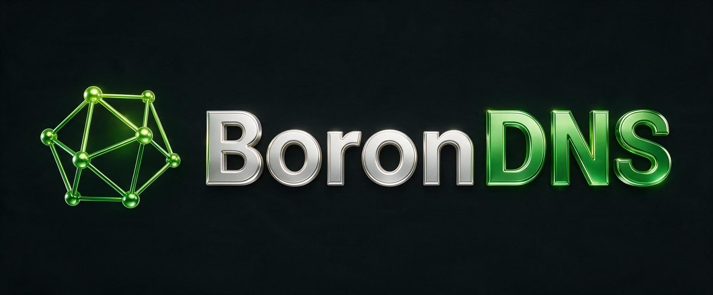

# BoronDNS

BoronDNS is an authoritative secondary DNS server. It transfers zones from
configured primaries over AXFR or IXFR, keeps the active data in memory, and
answers DNS queries over UDP and TCP. It does not provide recursion, originate
zones, or serve transfers to other secondaries.

Version 1.0 is the initial public release, with a public-beta maintenance policy.
See [SECURITY.md](SECURITY.md) for reporting vulnerabilities and supported
versions, and the [acceptance register](docs/release-acceptance-gap-register.md)
for evidence still needed to claim full SRS acceptance.

## What it supports

- IXFR with AXFR fallback, authenticated NOTIFY, and TSIG-protected transfers.
- Outbound zone transfer over TLS (XoT).
- Passive DNSSEC: serving signatures and denial records received from a primary.
- RFC 9432 catalog zones and optional member-transfer metadata.
- DNS Cookies, Response Rate Limiting, EDNS(0), and bounded EDE diagnostics.
- Reloadable TSIG and XoT credentials through filesystem secret snapshots.
- Health endpoints, Prometheus metrics, and optional JSON observability.
- Tunable UDP workers and an experimental Linux AF_XDP backend.

The [feature reference](docs/implemented-feature-scope.md) describes the limits
of each capability. BoronDNS serves DNSSEC records but does not sign zones or
validate DNSSEC chains. AF_XDP is opt-in; ordinary UDP sockets are the default.

External transfer telemetry is off by default. Enabling it sends zone names and
transfer outcomes to an operator-configured service; see the
[payload and configuration](docs/configuration.md#optional-external-control-plane).

## Get started

For installation, configuration, upgrades, and troubleshooting, use the
[operator guide](docs/operator-deployment-guide.md). For building from source,
use [getting started](docs/devops-getting-started.md).

With Rust and rustup installed, the repository selects the pinned toolchain
from [rust-toolchain.toml](rust-toolchain.toml). These are independent commands:

```bash
# Print an annotated example configuration.
cargo run --locked -p borondns-cli -- --example-config

# Validate a configuration, or inspect it with secrets redacted.
cargo run --locked -p borondns-cli -- --validate-config config/borondns.example.toml
cargo run --locked -p borondns-cli -- --dump-config config/borondns.example.toml

# Start the server with your edited configuration.
cargo run --locked -p borondns-cli -- --config /path/to/config.toml serve
```

The [example configuration](config/borondns.example.toml) uses high DNS ports.
Replace its sample primaries, zones, credentials, and listener addresses before
starting a service. At least one static zone or catalog zone is required.
The default configuration path is `/etc/borondns-secondary/config.toml`;
`--config` or `BORONDNS_CONFIG` selects another file.

## Development

Read [CONTRIBUTING.md](CONTRIBUTING.md) before submitting a change. The local
lint and test gate is `./scripts/check.sh`; the
[test plan](docs/test-plan.md) explains the additional integration and release
checks. Hosted release automation runs on version tags, not ordinary pushes.

| Component | Responsibility |
| --- | --- |
| `borondns-core` | DNS wire format, configuration, transfers, TSIG, and zone storage |
| `borondns-server` | Query listeners, refresh scheduling, persistence, and management |
| `borondns-cli` | The `borondns` command |
| [BoronGun](docs/boron-gun.md) | UDP/AF_XDP query load generator |
| [BoronGen](docs/boron-gen.md) | Synthetic primary for large-zone and incremental-transfer tests |

The workspace uses Rust 2024. Its build toolchain and declared minimum Rust
version are recorded separately in `rust-toolchain.toml` and `Cargo.toml`.
The internal crates are components of the server product; their Rust APIs and
ABI are not stable public interfaces.

Read the [architecture](docs/architecture.md) for the implementation overview,
or the [documentation index](docs/README.md) for protocol references,
benchmarks, requirements, and release evidence.

## License

BoronDNS is available under either the [MIT license](LICENSE-MIT) or
[Apache License 2.0](LICENSE-APACHE), at your option.
